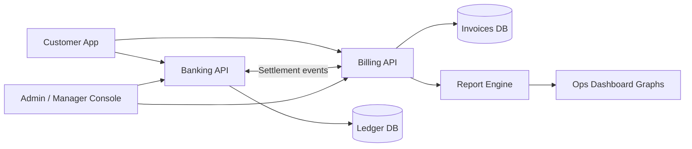
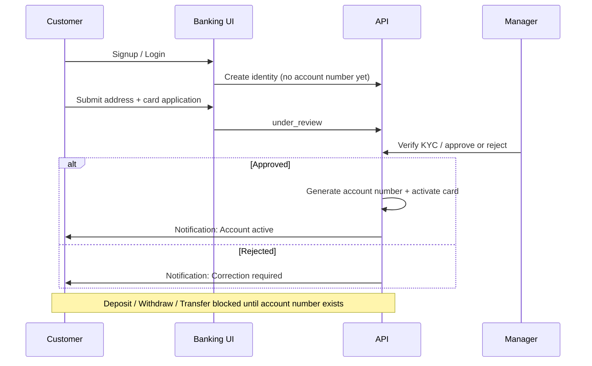
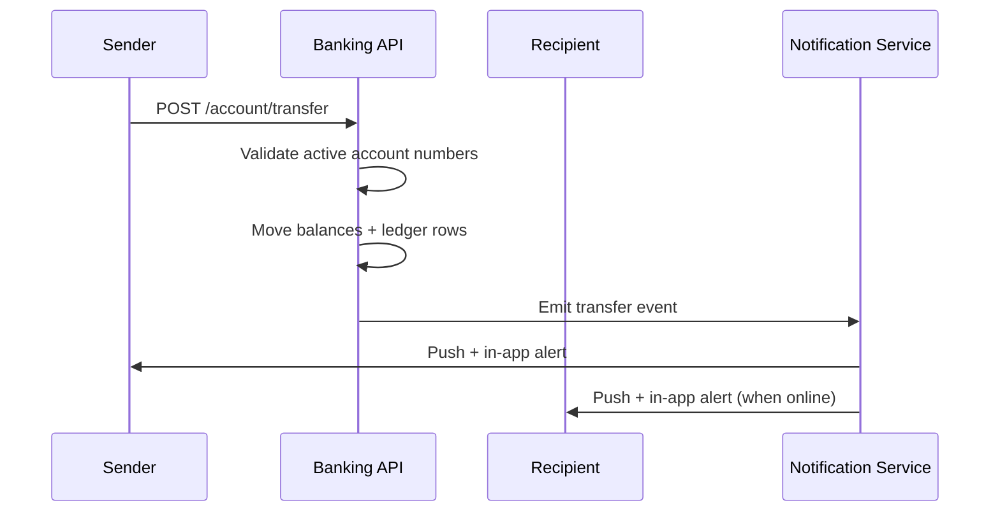
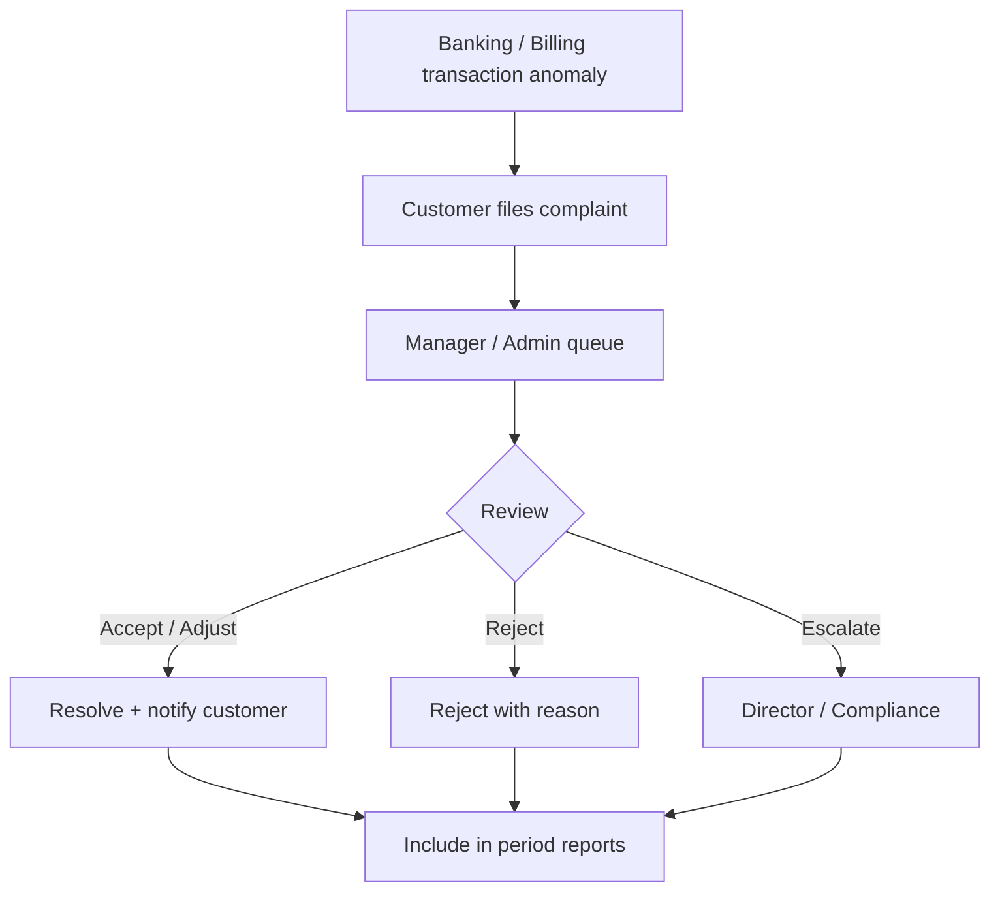

# Billing System ↔ Banking System Integration

This document captures the **planned Billing System** linkage. Banking lifecycle (account opening, cards, RBAC, admin, transfer push notifications) ships first; billing is designed here for a follow-up build.

## Goals

- Surface billing invoices, settlements, and dispute status inside NovaBank dashboards.
- Monitor money movement across banking ledgers and billing charges with shared references.
- Produce daily / weekly / bi-weekly / monthly operational reports with graphical views.
- Route complaints to Admin/Manager queues for accept / reject / resolve workflows.

## High-level architecture

## Account opening before money movement

## Transfer + push notification

## Billing complaint & approval loop

## Reporting cadence

Managers schedule banking ledger reports on `/manager/reports`. Billing System later merges invoice / settlement graphs into the same cadence. See `docs/manager-portal-roadmap.md`.

## Manager + Billing bridge

- Manager portal pages (`/manager`, Approvals, Reports, Billing) are the UI shell until Billing APIs ship.
- Shared settlement references connect banking transfers to Billing invoices.
- Complaint accept / reject / escalate lands on the Manager Billing queue with Admin escalation.

| Cadence | Banking view | Billing view |
| --- | --- | --- |
| Daily | Deposits, withdrawals, transfers, failed attempts | Settlements posted, open invoices |
| Weekly | Net flow, top counterparties | Aging buckets, dispute SLA |
| Bi-weekly | Exception queue burn-down | Chargeback / credit memos |
| Monthly | Statement-ready ledger export | Revenue recognition + fee schedule |

## Shared data contract (planned)

- `billingReference` on banking transactions
- `bankingAccountNumber` on billing invoices
- `complaintId` shared across both systems
- Webhook topics: `transfer.completed`, `invoice.paid`, `complaint.opened`, `complaint.resolved`

## Implementation order (agreed)

1. Banking: account lifecycle, card UX, RBAC admin, notifications, money locks ✅ (this PR)
2. Billing service scaffold + auth SSO with banking roles
3. Cross-system settlement events + dashboard widgets
4. Complaint workflows + graphical period reports
