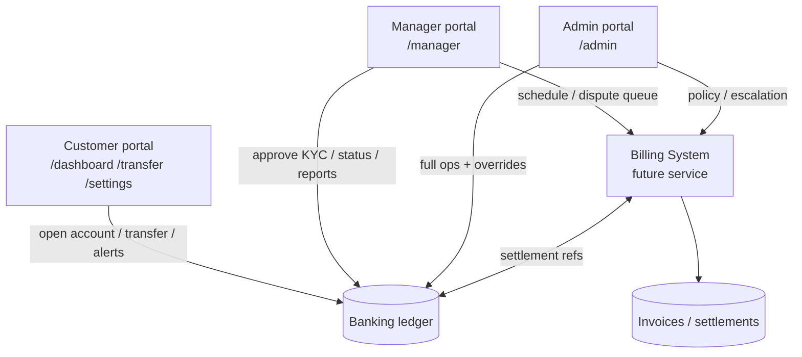
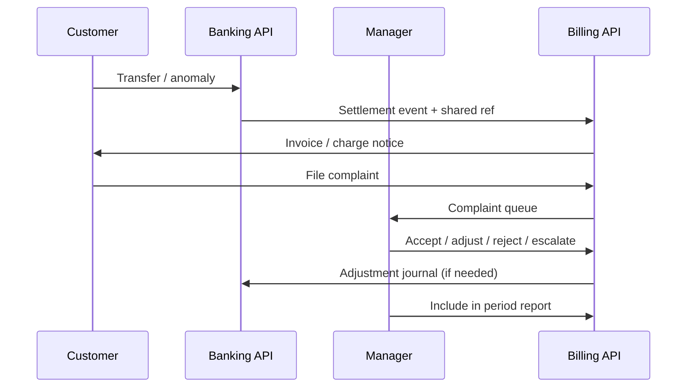

# Manager portal roadmap (through Billing System)

NovaBank staff roles are `admin` and `manager`. Customers always self-register as `customer`. Managers use the same Login page and land on **`/manager`**.

## Role relationships

| Capability | Customer | Manager | Admin |
| --- | --- | --- | --- |
| Signup (self-service) | Yes | No (seed / promote) | No (seed / promote) |
| Money movement | Own account | No | No |
| Approve openings | — | Yes | Yes |
| Customer status / delete | — | Yes | Yes |
| Transaction report schedules | — | Own desk | Ops overview |
| Billing settlements / complaints | File later | Review queue | Escalate / policy |
| Account settings (profile / avatar / password / theme) | Yes | Yes | Yes |

## Login & portals

- Same `/auth/login` for everyone.
- Redirect: `customer` → `/dashboard`, `manager` → `/manager`, `admin` → `/admin`.
- Seed a manager: `ADMIN_ROLE=manager node scripts/seed-admin.js` (see `docs/roles-and-admin.md`).

## Manager pages (shipped UI)

| Route | Purpose |
| --- | --- |
| `/manager` | Desk overview — customers, pending approvals, alerts, Billing preview |
| `/manager/customers` | Customer directory (pagination, view drawer, status actions) |
| `/manager/approvals` | Opening request approve / reject |
| `/manager/reports` | Cadence scheduler preview for banking ledger reports |
| `/manager/billing` | Billing bridge phases until the Billing API is live |
| `/settings` | Shared profile, presence, security, experience (theme / font) |
| `/notifications` | Alerts inbox (view only; no deep-link navigation) |

## Workflow phases

### Phase 1 — Banking operations (current)

1. Customer signs up → submits Card info → status `under_review`.
2. Manager Approvals → approve (issues account number) or reject.
3. Customer deposits / withdraws / transfers; both sides receive Alerts.
4. Manager Customers → activate / block / deactivate as needed.

### Phase 2 — Manager reports (UI ready, engine next)

1. Manager chooses daily / weekly / bi-weekly / monthly cadence on Reports.
2. Report engine (follow-up) aggregates deposits, withdrawals, transfers, openings.
3. Graphs + CSV export attach to the same page shell.

### Phase 3 — Manager + Billing System

1. Shared settlement / invoice IDs across banking ledger and Billing.
2. Manager Billing page shows invoice status, dispute queue, and report inclusion.
3. Admin handles escalations and policy exceptions.
4. Scheduled reports merge banking movement + Billing collections.

## Admin vs Manager split

- **Manager:** day-to-day customer care, KYC approvals, report schedules, Billing queues.
- **Admin:** same banking ops tools under `/admin`, plus future policy, staff promotion, and Billing escalations.
- Both share Account settings and Alerts.

## Implementation notes

- Manager Customers / Approvals reuse the Admin page templates and `AdminService` APIs.
- Billing APIs are not live yet — see `docs/billing-system-integration.md`.
- Copy `server-integration` routes (directory lookup, card metadata, settings theme/font) into `banking-system-server` when deploying.
